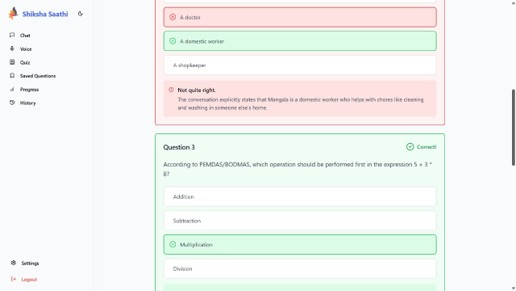

# Shiksha Saathi – AI Chatbot for Student Support

**Team:** SPARTANS  
**Hackathon:** EduAIthon  
**Problem Statement:** Lack of immediate academic support in remote areas hinders learning.

---

## 🧠 Overview

Shiksha Saathi is an AI-powered chatbot platform designed to provide instant academic support to students, especially in remote or underserved regions. It supports natural language queries across subjects like Math, Science, and English, and provides step-by-step, explainable answers.

---

## 🚀 Features

### 🤖 AI Chatbot
- Powered by **Google Gemini API** for natural language understanding.
- Supports domain-specific logic for **Math**, **Code**, and **Logical Reasoning**.
- Step-by-step solutions with interactive options:
  - `Show Hint`, `Next Step`, `Explain Again`

### 📚 RAG-Based Enhancement *(WIP)*
- Combines textbook/Q&A content with LLM output.
- Ensures curriculum-aligned and accurate responses.

### 🌐 Multilingual & Accessibility
- **Voice input/output** via Web Speech API.
- Supports regional languages (e.g., Hindi, Tamil).

### 🖥️ Modern UI/UX
- Built with **React + TypeScript**, **Tailwind CSS**, and **shadcn/ui**
- Responsive design with:
  - ✅ Login Page
  - ✅ Dark/Light Mode Toggle
  - ✅ Chat Interface with History
  - ✅ Quiz & Practice Mode
  - ✅ Voice Assistant Page
  - ✅ Progress Tracking Page

---

## 🛠️ Tech Stack

| Layer              | Technologies Used                           |
|-------------------|----------------------------------------------|
| Frontend          | React, TypeScript, Tailwind CSS, shadcn/ui   |
| Backend           | Node.js, SymPy (Math), Gemini API, spaCy     |
| AI/NLP            | Google Gemini, OpenAI (fallback), RAG        |
| Accessibility     | Web Speech API, iNLTK                        |
| Deployment        | GitHub                                       |

---

## 🧪 Implementation Snapshots

- **Login Page**  
  Enables user authentication and profile setup.

- **Chatbot Interface**  
  Live chat with context-aware doubt solving.

- **Quiz Page**  
  Practice and test modules for enhanced learning.

- **Voice Assistant**  
  Speech-based interaction for accessibility.

- **Progress Tracker**  
  Monitors user interactions and improvement over time.

- **Chat History**  
  Persistent and searchable query history.

---

## 🔍 Project Scope

- Multi-subject coverage: Math, Science, English (initial phase).
- Explainable answers tailored to academic levels.
- Supports regional languages and speech input/output.
- Designed to scale to more subjects and exam types.

---

## ✅ Results (Prototype Phase)

- Integrated Gemini for real-time academic query handling.
- Chat + Quiz features deployed with working frontend/backend.
- Achieved ~85% accuracy on sample questions.
- Positive feedback on clarity, interactivity, and voice accessibility.

---

## 📸 Screenshots

### 🔐 Login Screen

### 💬 AI Chat Interface

### 🧠 Quiz Mode

### 🎙️ Voice Assistant

### 📊 Progress Tracker

### 📜 Chat History

---

## 👥 Authors

- Amitesh Srinivas  

---

## 📝 License

MIT License 

